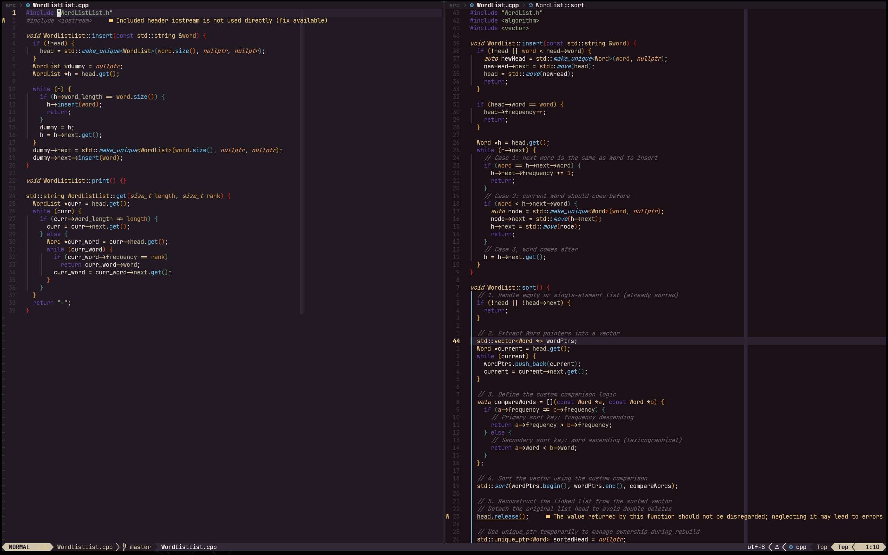

# 🏜️ Odyssey.nvim

A Neovim colorscheme inspired by the landscapes and colors of Alto's Odyssey.



## ✨ Features

- Carefully selected color palette inspired by the desert landscapes and night skies of Alto's Odyssey
- Dark theme optimized for long coding sessions
- Support for Treesitter syntax highlighting
- LSP diagnostic highlights
- Plugin integrations (Telescope, NvimTree, Git signs, etc.)

## 🌙 Colors

The colorscheme uses a carefully crafted palette:
- Deep purples for night backgrounds
- Warm sandy tones for highlights and accents
- Rich blues representing the night sky and water
- Earthy oranges and yellows for sunset-inspired accents

## 📦 Installation

### Using [lazy.nvim](https://github.com/folke/lazy.nvim)

```lua
{
  'yourusername/odyssey.nvim',
  lazy = false,
  priority = 1000,
  config = function()
    vim.cmd('colorscheme odyssey')
  end
}
```


## 🔧 Usage

After installation, set the colorscheme:

```vim
" In your init.vim
colorscheme odyssey
```

```lua
-- In your init.lua
vim.cmd('colorscheme odyssey')
```

## 🔌 Plugin Support

Odyssey.nvim includes highlight groups for:

- [Treesitter](https://github.com/nvim-treesitter/nvim-treesitter)
- [LSP Diagnostics](https://neovim.io/doc/user/lsp.html)
- [Telescope](https://github.com/nvim-telescope/telescope.nvim)
- [NvimTree](https://github.com/kyazdani42/nvim-tree.lua)
- [Git Signs](https://github.com/lewis6991/gitsigns.nvim)
- [Which Key](https://github.com/folke/which-key.nvim)
<!-- - [Indent Blankline](https://github.com/lukas-reineke/indent-blankline.nvim) -->

## 📷 Screenshots

*Coming soon*

## 💖 Credits

- Inspired by [Alto's Odyssey](https://www.altosodyssey.com/)

## 📄 License

MIT
